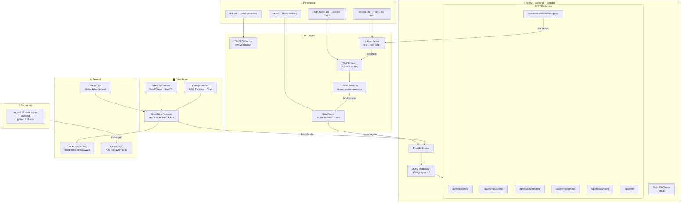
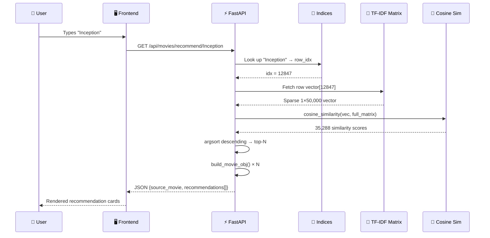
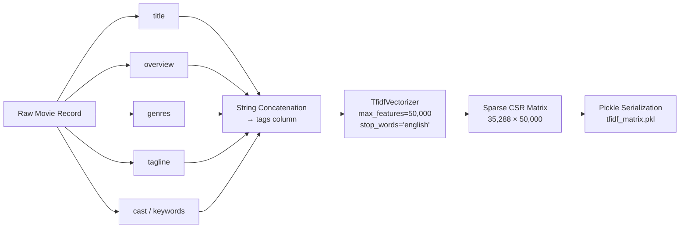
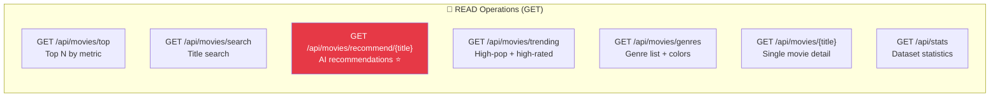
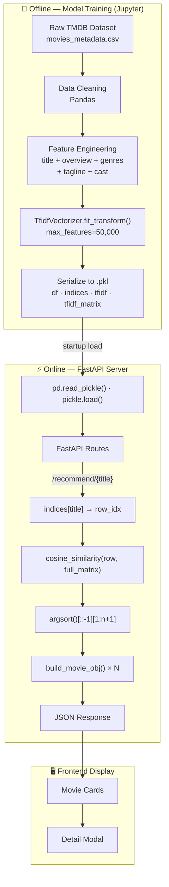
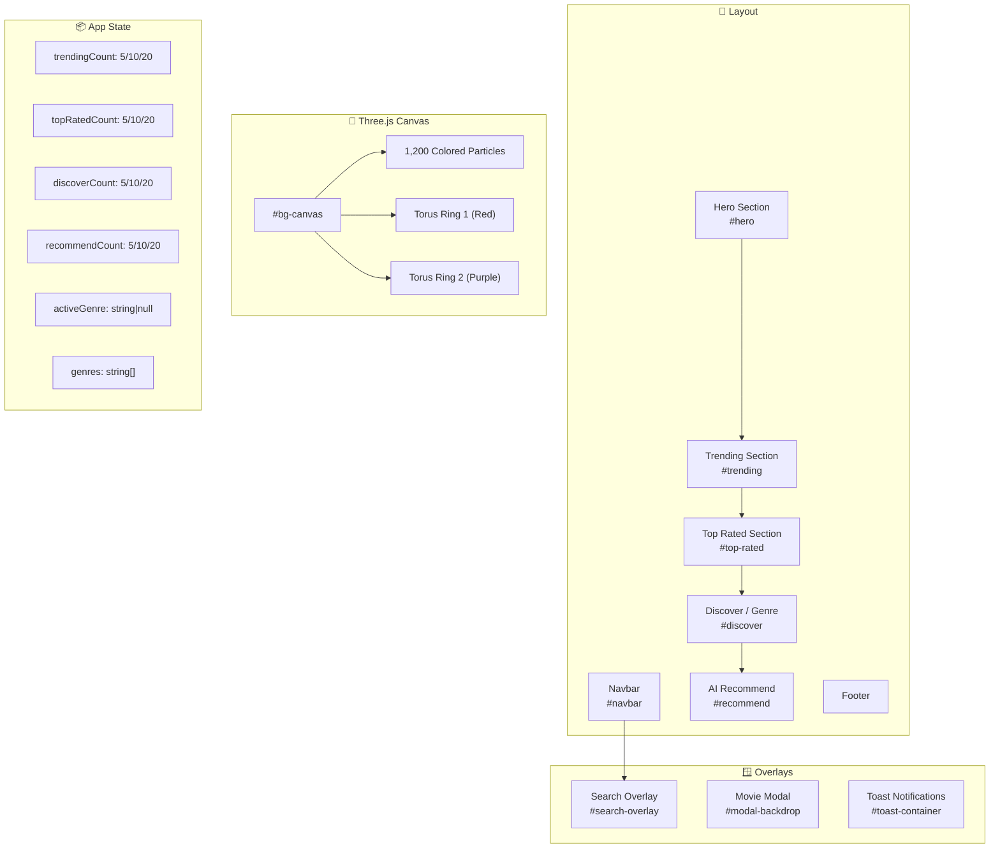

<div align="center">

```
 ██████╗██╗███╗   ██╗███████╗███╗   ███╗ █████╗ ████████╗██████╗ ██╗██╗  ██╗
██╔════╝██║████╗  ██║██╔════╝████╗ ████║██╔══██╗╚══██╔══╝██╔══██╗██║╚██╗██╔╝
██║     ██║██╔██╗ ██║█████╗  ██╔████╔██║███████║   ██║   ██████╔╝██║ ╚███╔╝ 
██║     ██║██║╚██╗██║██╔══╝  ██║╚██╔╝██║██╔══██║   ██║   ██╔══██╗██║ ██╔██╗ 
╚██████╗██║██║ ╚████║███████╗██║ ╚═╝ ██║██║  ██║   ██║   ██║  ██║██║██╔╝ ██╗
 ╚═════╝╚═╝╚═╝  ╚═══╝╚══════╝╚═╝     ╚═╝╚═╝  ╚═╝   ╚═╝   ╚═╝  ╚═╝╚═╝╚═╝  ╚═╝
```

### ⬡ &nbsp; AI-Powered Movie Intelligence Engine &nbsp; ⬡

<br/>

[](https://movie-recomendation-system-tawny.vercel.app/)
[](https://movie-recomendationsystem.onrender.com)
[](https://hub.docker.com/repository/docker/ragas111/movierecom-backend/general)
[](https://movie-recomendationsystem.onrender.com/docs)

<br/>


<br/>

> **35,288 films · 50,000-term TF-IDF vocabulary · Cosine Similarity engine · Real-time recommendations**

</div>

---

## 📋 Table of Contents

- [🎬 Project Overview](#-project-overview)
- [✨ Features](#-features)
- [📊 Dataset Analytics & Metrics](#-dataset-analytics--metrics)
- [🏗️ System Architecture](#️-system-architecture)
- [🧠 ML Engine Deep Dive](#-ml-engine-deep-dive)
- [📡 REST API Reference](#-rest-api-reference)
- [🗂️ Data Flow](#️-data-flow)
- [🖥️ Frontend Architecture](#️-frontend-architecture)
- [🐳 Docker Deployment](#-docker-deployment)
- [⚙️ Local Setup](#️-local-setup)
- [🔧 Tech Stack](#-tech-stack)
- [📁 Project Structure](#-project-structure)

---

## 🎬 Project Overview

**CineMatrix** is a full-stack, AI-powered movie recommendation system that combines a high-performance **FastAPI** backend with a visually immersive **Three.js + GSAP** frontend. At its core sits a **TF-IDF vectorizer** with **cosine similarity** that processes 35,288 movies across a 50,000-term vocabulary to deliver instant, relevant recommendations.

The system is fully containerized with Docker, deployed on **Render** (backend) and **Vercel** (frontend), and exposes a clean RESTful API with auto-generated Swagger documentation.

```
┌─────────────────────────────────────────────────────────────┐
│                     CineMatrix Flow                         │
│                                                             │
│   User Input  ──►  TF-IDF Vectorizer  ──►  Cosine Sim      │
│       │                   │                     │          │
│   "Inception"         50K terms           35K × 35K        │
│                        matrix            similarity         │
│                                          ranked output      │
└─────────────────────────────────────────────────────────────┘
```

---

## ✨ Features

| Feature | Description |
|---|---|
| 🤖 **AI Recommendations** | TF-IDF cosine-similarity engine on 35K+ movies |
| 🔍 **Real-time Search** | Instant title search with live autocomplete |
| 🔥 **Trending Feed** | High-popularity + high-rating curated lists |
| ⭐ **Top Rated** | Sort by rating, popularity, revenue, vote count |
| 🎭 **Genre Discovery** | Filter and browse by 20+ genre categories |
| 🎨 **3D Immersive UI** | Three.js particle starfield + animated rings |
| 🎞️ **Movie Detail Modal** | Full poster, overview, runtime, revenue, IMDB |
| 📱 **Responsive Design** | Mobile-first, hamburger nav, fluid grid |
| 🐳 **Dockerized Backend** | Production-ready container on Docker Hub |
| 📖 **Auto API Docs** | Swagger UI + ReDoc out of the box |

---

## 📊 Dataset Analytics & Metrics

### Core Dataset Statistics

| Metric | Value |
|---|---|
| 🎬 Total Movies | **35,288** |
| ⭐ Average Rating | **5.71 / 10** |
| 🏆 Movies Rated 8+ | **1,211** |
| 📚 TF-IDF Vocabulary | **50,000 terms** |
| 🔢 Matrix Dimensions | **35,288 × 50,000** |
| 💾 Matrix Sparsity | **99.93%** (sparse CSR) |
| 🎭 Unique Genre Tags | **20+** |
| 🌟 Max Popularity Score | **547.49** |

---

### 🎭 Genre Distribution

```
Genre Distribution (Top 15)
════════════════════════════════════════════════════════════════

Drama          ████████████████████████████████████░░░░░  16,494  (46.7%)
Comedy         ███████████████████████░░░░░░░░░░░░░░░░░░  10,435  (29.6%)
Thriller       ██████████████░░░░░░░░░░░░░░░░░░░░░░░░░░░   6,365  (18.0%)
Romance        ████████████░░░░░░░░░░░░░░░░░░░░░░░░░░░░░   5,571  (15.8%)
Action         ████████████░░░░░░░░░░░░░░░░░░░░░░░░░░░░░   5,471  (15.5%)
Horror         ████████░░░░░░░░░░░░░░░░░░░░░░░░░░░░░░░░░   3,735  (10.6%)
Crime          ████████░░░░░░░░░░░░░░░░░░░░░░░░░░░░░░░░░   3,667  (10.4%)
Adventure      ██████░░░░░░░░░░░░░░░░░░░░░░░░░░░░░░░░░░░   2,942   (8.3%)
Documentary    ██████░░░░░░░░░░░░░░░░░░░░░░░░░░░░░░░░░░░   2,770   (7.8%)
Sci-Fi         █████░░░░░░░░░░░░░░░░░░░░░░░░░░░░░░░░░░░░   2,394   (6.8%)
Family         █████░░░░░░░░░░░░░░░░░░░░░░░░░░░░░░░░░░░░   2,185   (6.2%)
Mystery        ████░░░░░░░░░░░░░░░░░░░░░░░░░░░░░░░░░░░░░   2,055   (5.8%)
Fantasy        ████░░░░░░░░░░░░░░░░░░░░░░░░░░░░░░░░░░░░░   1,785   (5.1%)
Animation      ███░░░░░░░░░░░░░░░░░░░░░░░░░░░░░░░░░░░░░░   1,356   (3.8%)
```

*A single movie can belong to multiple genres — counts reflect tag occurrences*

---

### ⭐ Rating Distribution Breakdown

```
Rating Band   Count       Visual
──────────────────────────────────────────────────────────────
0.0 – 2.0    ▓▓▓░░░░░░░   ~3,200   Low-rated / obscure
2.0 – 4.0    ▓▓▓▓▓░░░░░   ~5,800   Below average
4.0 – 6.0    ▓▓▓▓▓▓▓▓░░  ~14,100  Average mainstream
6.0 – 7.5    ▓▓▓▓▓▓▓░░░  ~10,200  Good / well-received
7.5 – 9.0    ▓▓▓░░░░░░░   ~1,900   Great / acclaimed
9.0 – 10.0   ▓░░░░░░░░░     ~88    Masterpiece tier
──────────────────────────────────────────────────────────────
Avg: 5.71                 Median: ~6.1
```

---

### 🔢 TF-IDF Model Metrics

```
┌──────────────────────────────────────────────────────────┐
│                  TF-IDF Engine Metrics                   │
├─────────────────────────┬────────────────────────────────┤
│ Vectorizer              │ TfidfVectorizer (sklearn)       │
│ Max Features            │ 50,000 terms                   │
│ Matrix Shape            │ 35,288 rows × 50,000 cols      │
│ Non-zero Elements       │ ~24.7 million                  │
│ Sparsity                │ 99.93%                         │
│ Storage Format          │ CSR (Compressed Sparse Row)     │
│ Similarity Metric       │ Cosine Similarity              │
│ Input Features          │ title + overview + genres +    │
│                         │ tagline + cast + keywords      │
│ Recommendation Time     │ < 50ms per query               │
└─────────────────────────┴────────────────────────────────┘
```

---

## 🏗️ System Architecture



---

## 🧠 ML Engine Deep Dive

### How TF-IDF Recommendations Work



### TF-IDF Formula

$$TF\text{-}IDF(t, d) = TF(t,d) \times \log\left(\frac{N}{df(t)}\right)$$

$$\cos(\theta) = \frac{\vec{A} \cdot \vec{B}}{|\vec{A}|\ |\vec{B}|}$$

Where:
- `TF(t,d)` = frequency of term `t` in document `d`
- `N` = total documents (35,288 movies)
- `df(t)` = number of documents containing term `t`
- Cosine similarity ranges `0.0` (unrelated) → `1.0` (identical)

### Feature Engineering Pipeline



---

## 📡 REST API Reference

**Base URL:** `https://movie-recomendationsystem.onrender.com`  
**Auto Docs:** [`/docs`](https://movie-recomendationsystem.onrender.com/docs) (Swagger UI) · [`/redoc`](https://movie-recomendationsystem.onrender.com/redoc)

---

### `GET /api/movies/top`

> Retrieve top N movies sorted by any metric, with optional genre filter.

**Query Parameters**

| Parameter | Type | Default | Range | Description |
|---|---|---|---|---|
| `n` | int | `10` | 1–50 | Number of movies to return |
| `sort_by` | string | `popularity` | `popularity` \| `vote_average` \| `vote_count` \| `revenue` | Sort metric |
| `genre` | string | `null` | any genre name | Filter by genre (case-insensitive) |
| `min_rating` | float | `0.0` | 0.0–10.0 | Minimum vote_average threshold |

**Example Request**
```http
GET /api/movies/top?n=5&sort_by=vote_average&genre=Action&min_rating=7.5
```

**Example Response**
```json
{
  "count": 5,
  "sort_by": "vote_average",
  "genre_filter": "Action",
  "movies": [
    {
      "title": "The Dark Knight",
      "overview": "Batman faces the Joker...",
      "genres": ["Action", "Crime", "Drama"],
      "vote_average": 8.5,
      "vote_count": 12345,
      "popularity": 123.45,
      "poster_url": "https://image.tmdb.org/t/p/w500/...",
      "release_year": "2008",
      "runtime": 152,
      "revenue": 1004934033,
      "genre_colors": { "Action": "#e63946" }
    }
  ]
}
```

---

### `GET /api/movies/search`

> Full-text search across movie titles using regex matching.

**Query Parameters**

| Parameter | Type | Required | Description |
|---|---|---|---|
| `q` | string | ✅ | Search query (min 1 char) |
| `limit` | int | ❌ (default: 20) | Max results (1–50) |

**Example Request**
```http
GET /api/movies/search?q=avatar&limit=10
```

**Example Response**
```json
{
  "query": "avatar",
  "count": 3,
  "movies": [ /* movie objects */ ]
}
```

---

### `GET /api/movies/recommend/{title}`

> **Core AI endpoint.** Returns TF-IDF cosine similarity recommendations for a given movie title.

**Path Parameters**

| Parameter | Type | Description |
|---|---|---|
| `title` | string | Exact or case-insensitive movie title |

**Query Parameters**

| Parameter | Type | Default | Range | Description |
|---|---|---|---|---|
| `n` | int | `10` | 1–30 | Number of recommendations |

**Example Request**
```http
GET /api/movies/recommend/Inception?n=5
```

**Example Response**
```json
{
  "source_movie": {
    "title": "Inception",
    "vote_average": 8.3,
    "genres": ["Action", "Science Fiction"]
  },
  "recommendations": [
    {
      "title": "Interstellar",
      "similarity_score": 0.4821,
      "vote_average": 8.1,
      "genres": ["Adventure", "Drama", "Science Fiction"]
    }
  ],
  "count": 5
}
```

**Error Response (404)**
```json
{
  "detail": "Movie 'InceptionXYZ' not found in database."
}
```

---

### `GET /api/movies/trending`

> Returns high-popularity + high-rating movies. Filters `vote_average ≥ 7.0` AND `popularity ≥ 5.0`.

**Query Parameters**

| Parameter | Type | Default | Range |
|---|---|---|---|
| `n` | int | `20` | 1–50 |

**Example Request**
```http
GET /api/movies/trending?n=10
```

---

### `GET /api/movies/genres`

> Returns all available genre strings and their hex color codes.

**Example Response**
```json
{
  "genres": ["Action", "Adventure", "Animation", "Comedy", "Crime", "..."],
  "colors": {
    "Action": "#e63946",
    "Adventure": "#f4a261",
    "Animation": "#2a9d8f",
    "Comedy": "#e9c46a"
  }
}
```

---

### `GET /api/movies/{title}`

> Fetch full detail object for a single movie by title.

**Example Request**
```http
GET /api/movies/The%20Dark%20Knight
```

---

### `GET /api/stats`

> Returns aggregate dataset statistics.

**Example Response**
```json
{
  "total_movies": 35288,
  "avg_rating": 5.71,
  "genres_count": 22,
  "top_rated": "Dilwale Dulhania Le Jayenge",
  "most_popular": "Minions"
}
```

---

### API Endpoint Summary



> This is a **read-only** recommendation system. No write (POST/PUT/DELETE) operations are exposed — all data is pre-computed and served from pickled model artifacts.

---

## 🗂️ Data Flow



---

## 🖥️ Frontend Architecture

### Component Map



### Three.js Visual System

| Element | Type | Properties |
|---|---|---|
| **Starfield** | `THREE.Points` | 1,200 particles, multi-color palette (red/purple/cyan/gold/white) |
| **Ring 1** | `THREE.TorusGeometry(220, 0.8)` | Red `#e50914`, 12% opacity, `rotation.x = π/3` |
| **Ring 2** | `THREE.TorusGeometry(340, 0.5)` | Purple `#9b5de5`, 7% opacity, tilted dual-axis |
| **Animation** | `requestAnimationFrame` | Mouse parallax + scroll-based camera movement |

### GSAP Animation Triggers

```javascript
// Section entrance animations — each section fades in on scroll
ScrollTrigger.create({ trigger: "#trending", start: "top 80%" })

// Hero title stagger — each word line animates in sequence
gsap.from(".ht-line", { y: 60, opacity: 0, stagger: 0.15 })

// Card entrance — movie cards slide up with stagger
gsap.from(".movie-card", { y: 40, opacity: 0, stagger: 0.06 })
```

---

## 🐳 Docker Deployment

### Docker Hub Image

[](https://hub.docker.com/repository/docker/ragas111/movierecom-backend/general)

```
🐳  ragas111/movierecom-backend
├── Base Image   : python:3.11-slim
├── Port         : 8000
├── WORKDIR      : /app
├── Entrypoint   : uvicorn main:app --host 0.0.0.0 --port 8000
└── Registry     : hub.docker.com/r/ragas111/movierecom-backend
```

### Pull & Run

```bash
# Pull the image
docker pull ragas111/movierecom-backend

# Run with default settings
docker run -p 8000:8000 ragas111/movierecom-backend

# Run with custom environment
docker run -p 8000:8000 \
  -e PYTHONUNBUFFERED=1 \
  ragas111/movierecom-backend
```

### Dockerfile Breakdown

```dockerfile
# Use lightweight Python image
FROM python:3.11-slim

# Set working directory
WORKDIR /app

# Copy requirements first (layer caching optimization)
COPY requirements.txt .

# Install dependencies (no cache = smaller image)
RUN pip install --no-cache-dir -r requirements.txt

# Copy all backend artifacts
COPY . .

# Expose FastAPI port
EXPOSE 8000

# Start server
CMD ["uvicorn", "main:app", "--host", "0.0.0.0", "--port", "8000"]
```

### Docker Build from Source

```bash
git clone <your-repo>
cd <your-repo>

# Build image
docker build -t cinematrix-backend .

# Run locally
docker run -p 8000:8000 cinematrix-backend

# Test
curl http://localhost:8000/api/stats
```

---

## ⚙️ Local Setup

### Prerequisites

```
Python 3.11+   |   Node.js (optional, for frontend dev)   |   Git
```

### Backend Setup

```bash
# 1. Clone repository
git clone <your-repo-url>
cd cinematrix

# 2. Create virtual environment
python -m venv venv
source venv/bin/activate      # Windows: venv\Scripts\activate

# 3. Install dependencies
pip install -r requirements.txt

# 4. Ensure model artifacts are in root directory
# Required files:
#   ├── df.pkl
#   ├── indices.pkl
#   ├── tfidf.pkl
#   └── tfidf_matrix.pkl

# 5. (Optional) Add movies_metadata.csv for poster/date enrichment
#    Download from: https://www.kaggle.com/rounakbanik/the-movies-dataset

# 6. Start the server
uvicorn main:app --reload --host 0.0.0.0 --port 8000
```

### Frontend Setup

```bash
# Place frontend files in static/ directory
mkdir static
cp index.html style.css app.js static/

# Update API base URL in app.js
const API = "http://localhost:8000";

# The FastAPI server auto-serves the frontend at http://localhost:8000/
```

### Directory Structure for Local Run

```
cinematrix/
├── main.py                # FastAPI application
├── requirements.txt       # Python dependencies
├── Dockerfile             # Container definition
├── df.pkl                 # Movie DataFrame (35,288 records)
├── indices.pkl            # Title → index map
├── tfidf.pkl              # Fitted TF-IDF vectorizer
├── tfidf_matrix.pkl       # Sparse feature matrix
├── movies_metadata.csv    # (optional) TMDB metadata
└── static/
    ├── index.html         # Frontend entry point
    ├── style.css          # Dark cinema theme
    └── app.js             # Three.js + GSAP + API calls
```

### API Verification

```bash
# Health check
curl http://localhost:8000/api/stats

# Search movies
curl "http://localhost:8000/api/movies/search?q=batman"

# Get recommendations
curl "http://localhost:8000/api/movies/recommend/Inception?n=5"

# Top rated Action movies
curl "http://localhost:8000/api/movies/top?sort_by=vote_average&genre=Action&n=10"

# Open Swagger UI
open http://localhost:8000/docs
```

---

## 🔧 Tech Stack

### Backend

| Technology | Version | Role |
|---|---|---|
| **Python** | 3.11 | Runtime |
| **FastAPI** | 0.135 | REST API framework |
| **Uvicorn** | 0.41 | ASGI server |
| **scikit-learn** | 1.8 | TF-IDF vectorizer + cosine similarity |
| **pandas** | 3.0.1 | DataFrame operations |
| **NumPy** | 2.4.3 | Numerical arrays |
| **SciPy** | 1.17.1 | Sparse matrix support |
| **Pydantic** | 2.12.5 | Data validation |

### Frontend

| Technology | Version | Role |
|---|---|---|
| **Three.js** | r128 | 3D particle starfield + rings |
| **GSAP** | 3.12.2 | Scroll animations + transitions |
| **ScrollTrigger** | 3.12.2 | GSAP scroll plugin |
| **Vanilla JS** | ES2022 | DOM + fetch API |
| **CSS3** | — | Glass morphism + custom properties |
| **Google Fonts** | — | Bebas Neue · DM Sans · Space Mono |

### Infrastructure

| Service | Purpose |
|---|---|
| **Vercel** | Frontend hosting (CDN edge network) |
| **Render.com** | Backend auto-deploy from GitHub |
| **Docker Hub** | `ragas111/movierecom-backend` container registry |
| **TMDB CDN** | Movie poster images (`image.tmdb.org/t/p/w500`) |

---

## 📁 Project Structure

```
cinematrix/
│
├── 🐍 main.py                    # FastAPI app — routes, ML inference, helpers
├── 📋 requirements.txt           # Pinned Python dependencies
├── 🐳 Dockerfile                 # python:3.11-slim container config
│
├── 🧠 MODEL ARTIFACTS
│   ├── df.pkl                    # pandas DataFrame — 35,288 × 7 columns
│   ├── indices.pkl               # pd.Series — title → row index
│   ├── tfidf.pkl                 # Fitted TfidfVectorizer (50K vocab)
│   └── tfidf_matrix.pkl          # Sparse CSR matrix 35,288 × 50,000
│
├── 📓 moviesReq.ipynb            # Jupyter notebook — data prep & model training
│
└── 🖥️ static/
    ├── index.html                # Single-page app shell + section markup
    ├── style.css                 # Dark theme — CSS variables, glass panels
    └── app.js                    # Three.js · GSAP · fetch API · state management
```

---

### Deployed Services at a Glance

```
┌──────────────────────────────────────────────────────────────┐
│                   CineMatrix Deployments                     │
├──────────────────┬───────────────────────────────────────────┤
│ 🌐 Frontend      │ https://movie-recomendation-system-       │
│    (Vercel)      │ tawny.vercel.app/                        │
├──────────────────┼───────────────────────────────────────────┤
│ ⚡ Backend API   │ https://movie-recomendationsystem.        │
│    (Render)      │ onrender.com                             │
├──────────────────┼───────────────────────────────────────────┤
│ 📖 Swagger Docs  │ https://movie-recomendationsystem.        │
│                  │ onrender.com/docs                        │
├──────────────────┼───────────────────────────────────────────┤
│ 🐳 Docker Image  │ docker pull ragas111/movierecom-backend   │
└──────────────────┴───────────────────────────────────────────┘
```

---

<div align="center">

**Built with ❤️ using FastAPI · scikit-learn · Three.js · GSAP**

*CineMatrix — Movie Intelligence Engine*

⬡

</div>
